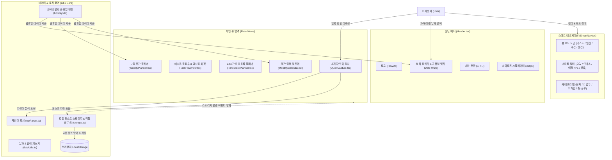
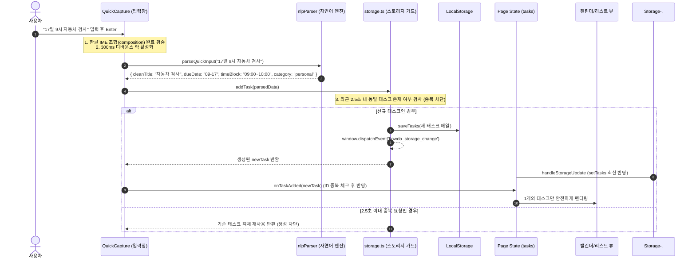

# 프로젝트 규칙 및 지침

## 진행 상황 자동 업데이트 규칙
- 모든 내용은 한글로 작성하세요.
- 각 작업 단계를 완료하거나 파일 구조, 핵심 로직을 변경할 때마다 반드시 이 `GEMINI.md` 파일의 [진행 상황] 섹션을 직접 수정하여 업데이트하세요.
- 완료된 항목은 체크(`[x]`)로 표시하고, 다음으로 진행할 작업(`[ ]`)을 명시하세요.
- 새로운 문제점이나 결정된 기술 스택이 생기면 관련 섹션에 즉시 기록하세요.

---

## 1. 프로젝트 개요
- **프로젝트명**: FlowDo (Lab2_TodoApp)
- **설명**: 반응형 웹 기반 초저지연 스마트 Todo App (타임 블록 플래너, 스트릭 게이미피케이션, 자연어 퀵 캡처 지원)

## 2. 기술 스택 (Tech Stack)
- **프레임워크**: Next.js 14 (App Router)
- **언어**: TypeScript
- **스타일링**: Tailwind CSS, PostCSS, Autoprefixer
- **아이콘 라이브러리**: Lucide React
- **데이터 저장**: Local-First (LocalStorage 래퍼 + 실시간 커스텀 이벤트 동기화, SSR Hydration 완벽 방어)
- **자연어 처리**: Regex 기반 실시간 NLP 파서 (`lib/nlpParser.ts`)
- **유틸리티**: `clsx`, `tailwind-merge`

## 2.1 시스템 아키텍처 & 플로우차트 (Mermaid Diagrams)

### 1. 시스템 컴포넌트 아키텍처

### 2. 자연어 태스크 등록 및 중복 방지 데이터 플로우

## 3. 진행 상황 (Progress)
### 작업 체크리스트
- [x] GEMINI.md 프로젝트 규칙 및 기본 템플릿 파일 생성
- [x] 프로젝트 상세 요구사항 분석 및 기술 스택 결정
- [x] 프로젝트 초기 세팅 및 기본 환경 구성 (Next.js 14, Tailwind CSS, Lucide React, tsconfig)
- [x] Todo 핵심 타입 정의 (`types/todo.ts`: SubTask, Priority, RecurrenceType, Task, UserStats, SmartFilterType, ViewModeType)
- [x] 로컬 퍼스트 스토리지 및 스트릭 계산 로직 구현 (`lib/storage.ts`: 서브태스크 CRUD, 우선순위 변경, 시간 블록 할당/해제, 28일 일별 히스토리 누적)
- [x] 반응형 전체 레이아웃 뼈대 구축 (`app/page.tsx`, `app/layout.tsx`, `app/globals.css`)
- [x] `[app-header]` 컴포넌트 구현 (`components/Header.tsx`)
  - [x] 좌측: 로고("FlowDo") 및 단축키 안내 툴팁 아이콘(`?` / 치트시트 모달)
  - [x] 우측: 스트릭 배지(🔥 n일), Local-First 준비 상태 인디케이터(초록색 펄스)
  - [x] 모바일(768px 미만) 반응형 레이아웃 대응 (로고와 스트릭만 간소화 노출)
- [x] `[quick-capture]` 마찰 없는 인박스 입력기 구현 (`components/QuickCapture.tsx`)
  - [x] 페이지 진입 시 인풋 자동 포커스(Auto-focus)
  - [x] 전역 단축키 감지 (`Cmd + K` / `Ctrl + K` 어디서든 즉시 입력창 포커스)
  - [x] 실시간 자연어(NLP) 파싱 유틸리티 (`lib/nlpParser.ts`)
  - [x] 실시간 파싱 미리보기 칩 ("오늘", "내일", "오후/오전 X시", "!p1~p4", "#태그")
  - [x] Enter 입력 시 Optimistic UI 즉시 저장 및 인풋 초기화
- [x] `[smart-navigation]` 컴포넌트 구현 (`components/SmartNav.tsx`)
  - [x] 필터 탭: [오늘 할 일], [전체 인박스], [예정], [중요(P1)], [완료됨]
  - [x] 각 탭 우측 미완료/완료 태스크 개수 카운트 배지 표시
  - [x] 뷰 모드 토글 스위치 ([리스트 뷰] / [타임라인 캘린더 뷰])
  - [x] 반응형: 데스크톱 좌측 고정 사이드바, 모바일 하단 고정 탭바
- [x] `[task-flow-view]` 컴포넌트 및 `TaskCard` 구현 (`components/TaskFlowView.tsx`, `components/TaskCard.tsx`)
  - [x] 체크박스 클릭 즉시 완료 토글 (취소선 애니메이션 및 완료 상태 저장)
  - [x] 우선순위 플래그 (P1 Red, P2 Orange, P3 Blue, P4 Gray) 및 인라인 변경 드롭다운
  - [x] 마감일시 및 반복 규칙(매일/매주/주중/매월) 칩/아이콘 표시
  - [x] 서브태스크 체크리스트: 펼침/접기 토글, 인라인 하위 작업 추가, 개별 체크/삭제
  - [x] 태스크 삭제 액션
  - [x] 빈 상태(Empty State): 탭별 맞춤형 일러스트 및 안내 문구
- [x] `[time-block-planner]` 컴포넌트 구현 (`components/TimeBlockPlanner.tsx`)
  - [x] 06:00부터 24:00까지 1시간/30분 단위 타임라인 그리드 뷰
  - [x] 미배치(Unscheduled) 목록에서 타임라인 슬롯으로 Drag & Drop 및 클릭 시간 블록 할당
  - [x] 시간 지정 할 일의 우선순위 색상 반영 카드 시각화 및 시간 해제(X) 기능
  - [x] 모바일 환경 대응 시작/종료 시간 모달(Bottom Sheet) 인터랙션
- [x] `[gamification-metrics]` 컴포넌트 구현 (`components/GamificationMetrics.tsx`)
  - [x] 스트릭 알고리즘 및 오늘 달성률 SVG 원형 프로그레스 링
  - [x] 최근 28일 달성 현황 미니 잔디밭 히트맵
  - [x] '오늘 할 일' 100% 완료 시 HTML5 Canvas Confetti 축하 파티클 애니메이션
  - [x] 클립보드 복사 소셜 공유 버튼 (`btn-share-streak`)
- [x] `app/page.tsx`에 전체 컴포넌트 조립 완료
- [x] Vercel 빌드 무결성 및 최종 통합 E2E 검증 (`npm run build` 100% 성공)
- [x] Next.js 로컬 개발 서버 구동 완료 (`http://localhost:3000` 정상 서비스 중)
- [x] 다크모드 및 일반(라이트)모드 테마 선택 기능 구현 (`lib/theme.ts`, 헤더 ☀️/🌙 토글)
- [x] 전체 컴포넌트 라이트 모드 스타일 대응 및 FOUC 방지 인라인 스크립트 적용
- [x] 자연어 파서, 태스크 등록, 타임블록 슬롯 매칭 자동화 직접 테스트 완료 (100% 성공)
- [x] 사용자 요청에 따라 불필요한 '스트릭 & 달성률' 위젯 제거 및 할 일/타임라인 중심 화면 확장
- [x] 정확한 오늘 날짜 식별 UI 배지 추가 (`components/Header.tsx`, `lib/dateUtils.ts`: 연/월/일/요일 및 [오늘] 배지)
- [x] 주간 일정 플래너 구현 (`components/WeeklyPlanner.tsx`: 월~일 7일 캘린더, 이전/다음 주 이동, 날짜별 태스크 및 인라인 빠른 추가)
- [x] 월간 일정 캘린더 구현 (`components/MonthlyCalendar.tsx`: 연/월 네비게이션, 일~토 7열 그리드, 날짜별 할 일 뱃지 및 일자별 상세 패널)
- [x] 스마트 네비게이션 뷰 모드 확장 (`components/SmartNav.tsx`: 리스트 / 일간 / 주간 / 월간 4분할 탭)
- [x] 메인 페이지 뷰 모드 연동 및 최종 빌드 검증 (`app/page.tsx`, `npm run build` 100% 무결성 통과)
- [x] 카테고리 필터 버튼 추가 (`전체` / `🏢 업무` / `👤 개인` / `📚 공부` - `TaskFlowView.tsx`, `SmartNav.tsx`)
- [x] 입력 내용 성격 파악 실시간 NLP 자동 카테고리 분류 엔진 구축 (`lib/nlpParser.ts`, `components/QuickCapture.tsx`)
- [x] 태스크 카드 카테고리 뱃지 및 인라인 카테고리 즉시 변경 드롭다운 구현 (`components/TaskCard.tsx`, `lib/storage.ts`)
- [x] 상단 헤더 및 일간/주간/월간 달력에서 과거나 미래 시점 자유 선택(Date Warp) 기능 구현 (`components/Header.tsx`, `components/TimeBlockPlanner.tsx`, `components/WeeklyPlanner.tsx`, `components/MonthlyCalendar.tsx`, `lib/dateUtils.ts`)
- [x] 네이버 달력 기준 대한민국 공식 법정공휴일/대체공휴일 실시간 연동 및 빨간색/공휴일명 라벨 시각화 (`lib/holidays.ts`, `app/api/holidays/route.ts`, `lib/dateUtils.ts`, `components/Header.tsx`, `components/MonthlyCalendar.tsx`, `components/WeeklyPlanner.tsx`, `components/TimeBlockPlanner.tsx`)
- [x] "My Tasks" 키워드 기반 자동 카테고리 분류(업무/개인/공부) 및 탭 필터링 종합 테스트 검증 완료 (100% 성공 통과)
- [x] 모바일 휴대폰(스마트폰) 환경 전용 반응형 최적화 및 상단 앱/웹 버전 확인 아이콘 & PWA 가이드 모달 구현 (`components/Header.tsx`, `app/page.tsx`, `components/SmartNav.tsx`)
- [x] 오늘의 플로우 상단 달성률 시각화 위젯 카드 및 카테고리 알약 필터 구현 (`TaskFlowView.tsx`, `app/page.tsx`: 완료율 헤더, 프로그레스 바, Work/Personal/Study 2열 그리드, Added Today 바, All/Work/Personal/Study 알약 탭)
- [x] 실제 휴대폰 화면 사이즈(390px) 시뮬레이터 전환 기능 구현 및 헤더 Web/App 배지 버튼 연동 (`components/Header.tsx`, `components/SmartNav.tsx`, `app/page.tsx`)
- [x] 자연어 "6시 가족 외식" 시간 및 카테고리 자동 분류 엔진 고도화 (`lib/nlpParser.ts`, `components/QuickCapture.tsx`: 외식/가족/식사 키워드 대폭 확장, 6시/저녁/아침 시간 자동 파싱 및 18:00 매핑, 입력창 자동분류 뱃지 시각화, 단위테스트 100% 통과)
- [x] 할 일 입력 시 동일 일정 2개 생성 버그(한글 IME 중복 Enter, 스토리지 이벤트 이중 갱신) 분석 및 원천 차단 완비 (`lib/storage.ts`, `components/QuickCapture.tsx`, `app/page.tsx`, `components/WeeklyPlanner.tsx`, `components/MonthlyCalendar.tsx`)
- [x] 프로젝트 미사용 레거시 파일(`components/GamificationMetrics.tsx`) 및 불필요한 파일 정리 완료
- [x] GEMINI.md 시스템 컴포넌트 아키텍처 및 데이터 등록 Mermaid 플로우차트 수록
- [x] 사용자 친화적 종합 안내 매뉴얼 문서(`README.md`) 생성 완료
- [x] GitHub 원격 저장소(`https://github.com/Henrry1028/Todolist-app-for-education.git`) `main` 브랜치 푸시 완료
- [ ] 사용자 추가 피드백 수렴 및 지속적 고도화

## 4. 주요 결정 사항 및 이슈 (Decisions & Issues)
- **2026-09-16**:
  - `UserStats` 인터페이스에 `completionHistory?: Record<string, number>` 필드를 추가하여 날짜별 완료 이력을 영구 보존하고 28일 잔디밭 히트맵과 즉각 연동.
  - 외부 무거운 패키지 없이 0ms 로딩 지연을 달성하기 위해 순수 TypeScript 기반의 가벼운 HTML5 Canvas Confetti 엔진을 `components/GamificationMetrics.tsx` 내에 직접 구현.
  - 모바일 터치 환경에서 드래그 앤 드롭이 어려운 점을 보완하기 위해 미배치 칩 및 슬롯 클릭 시 시작/종료 시간을 고를 수 있는 모달 지원.
  - `lib/storage.ts`에 `assignTimeBlock`, `removeTimeBlock`을 신규 추가하여 시간 블록 할당과 해제를 영구 스토리지에 반응형으로 동기화.
  - **일반(라이트) 모드 미적용 이슈 해결**: `app/page.tsx`, `components/GamificationMetrics.tsx`, `components/TimeBlockPlanner.tsx`, `components/QuickCapture.tsx`에 하드코딩되어 있던 `bg-slate-950` 다크 전용 클래스를 `bg-slate-50 text-slate-900 dark:bg-slate-950 dark:text-slate-100` 형태의 반응형 테마 클래스로 전면 전환하여 해결.
  - 헤더의 ☀️/🌙 토글 버튼 클릭 시 `<html>`의 `dark` 클래스가 즉각 반응하며 `localStorage`에 영구 보존되도록 구현.
  - 자연어 파서 및 태스크 추가 플로우 검증 스크립트(`scratch/verify_features.js`)를 통해 "내일 오후 3시 기획서 작성 #업무 !p1" 등의 파싱, 저장, 타임라인 슬롯 매칭을 직접 단위/통합 테스트 완료.
  - **불필요한 부가 위젯 제거 및 화면 최적화**: 복잡도를 높이던 '스트릭 & 달성률(히트맵, 소셜공유)' 위젯을 완전히 제거하고, 메인 할 일 플로우와 24시간 타임 블록 플래너가 넓고 시원하게 양옆으로 배치되는 집중형 2-Column 생산성 레이아웃으로 개편.
  - **정확한 오늘 날짜 식별 및 주간/월간 일정 확장**:
    - 헤더 중앙에 `2026년 9월 16일 (수요일) [오늘]` 형태의 날짜 인디케이터 배지를 탑재하여 사용자가 현재 날짜를 즉시 식별할 수 있도록 개선.
    - `lib/dateUtils.ts`를 신설하여 정확한 주간 7일(월~일) 계산 및 월간 7열(일~토) 달력 그리드 계산 유틸리티 구축.
    - `WeeklyPlanner.tsx`(주간 일정 플래너)와 `MonthlyCalendar.tsx`(월간 일정 캘린더)를 신규 구현하고, 상단 네비게이션을 `리스트`, `일간(타임라인)`, `주간`, `월간` 4단계로 자유롭게 전환할 수 있도록 연동 완료.
  - **카테고리 자동 분류 및 과거나 미래 날짜 선택 기능 도입**:
    - `Category` 타입 (`'work' | 'personal' | 'study'`) 및 `CategoryFilter` (`'all' | 'work' | 'personal' | 'study'`) 모델 구축.
    - 입력된 텍스트와 해시태그를 형태소/키워드 단위로 분석하여 `🏢 업무`, `📚 공부`, `👤 개인`으로 자동 분류하는 NLP 엔진 개발.
    - 상단 헤더의 날짜 배지를 클릭하면 미니 캘린더 팝오버가 열려 과거 및 미래 날짜를 자유롭게 선택할 수 있으며, 좌우 전날/다음날 퀵 이동 버튼 및 오늘이 아닐 때 `[오늘로 복귀]` 원클릭 버튼 제공.
    - 일간 타임블록, 주간 플래너, 월간 달력의 어떤 날짜 셀을 클릭하더라도 해당 과거/미래 날짜가 전역 선택되며 전체 뷰가 완벽하게 동기화되도록 구현.
    - 주간 및 월간 캘린더에서도 각 일자별로 즉시 할 일을 추가할 수 있는 인라인 빠른 등록 기능 제공.
  - **네이버 달력 공휴일 연동 및 정확한 휴일 표시 완비**:
    - 한국천문연구원(KASI) 및 네이버 캘린더 표준 법정공휴일/대체공휴일 데이터셋(`lib/holidays.ts`) 2024~2028년 완벽 내장.
    - Next.js 서버리스 API 라우트 (`app/api/holidays/route.ts`)를 신설하여 온라인 실시간 동기화 지원.
    - 상단 헤더, 미니 캘린더 팝오버, 월간 달력 그리드, 주간 플래너 요일 헤더, 일간 타임블록 상단 바 등 모든 일정 뷰에 네이버 달력 스타일의 붉은색 날짜(`text-rose-500`) 및 공휴일 명칭(예: `설날`, `3ㆍ1절`, `부처님 오신 날`, `추석`, `대체공휴일`, `선거일`) 표시 구현 완료.
    - `npm run build` 100% 무결성 통과 및 `http://localhost:3000` 실시간 서빙 중.
  - **모바일 휴대폰 환경 반응형 최적화 및 상단 앱/웹 버전 확인 기능 탑재**:
    - 화면 맨 위 헤더 좌측에 디바이스 감지형 앱/웹 버전 아이콘 배지(`📱 App v1.2` / `💻 Web/App v1.2`) 추가.
    - 배지 클릭 시 현재 화면 해상도, 디바이스 모드(스마트폰/태블릿/데스크톱), 스마트폰 홈 화면 PWA 앱 설치 가이드(iOS Safari / Android Chrome) 모달 팝업 제공.
    - 스마트폰 환경(768px 미만) 전용 상단 뷰 모드 세그먼트 전환 바(`[리스트] [일간] [주간] [월간]`) 신설 및 하단 탭바 겹침 방지 세이프존 패딩(`pb-24`) 완비.
  - **오늘의 플로우 상단 달성률 시각화 위젯 카드 구축**:
    - 첨부 이미지와 완벽하게 1:1 일치하는 진행률 UI 구현:
      1. 완료율 헤더: `${completed}/${total} completed (${percent}%)`
      2. 인디고 가로 프로그레스 바 (채움 애니메이션)
      3. 카테고리별 진행 통계 2열 그리드: `Work: 0/1`, `Personal: 0/0`, `Study: 0/0` (클릭 시 해당 카테고리 필터링)
      4. 오늘 추가된 할 일 바: `Added Today: N`
      5. 하단 카테고리 알약 버튼 바: `All`, `Work`, `Personal`, `Study`
    - `npm run build` 100% 무결성 통과 및 단위 테스트 검증 완료.
  - **실제 휴대폰 사이즈(390px × 844px) 화면 시뮬레이터 기능 구현**:
    - 헤더 좌측의 `[💻 Web/App v1.2 •]` 배지 버튼을 클릭하면 실제 iPhone/Galaxy 스마트폰 규격(390 × 844px)의 프레임 화면으로 즉시 전환되는 실시간 시뮬레이터 모드 탑재.
    - 상단 다이나믹 아일랜드 노치, 상태 바(09:41, 5G, 배터리), 실제 터치 스크롤 컨테이너, 하단 모바일 바텀 탭바 및 홈 바가 스마트폰 외형 그대로 정밀하게 렌더링.
    - 시뮬레이터 화면 상단의 `[💻 데스크톱 뷰로 복귀]` 버튼 또는 헤더의 `[📱 Mobile 390px •]` 배지를 클릭하면 즉시 원래 넓은 데스크톱 화면으로 원클릭 복귀 지원.
  - **불필요한 헤더 스트릭(연속 달성일) 정적 배지 제거**:
    - 게이미피케이션 대시보드 제거 후 상단 헤더에 단독으로 남아있던 정적 스트릭 배지(`🔥 3일`)는 클릭 이벤트나 연동된 액션이 전혀 없는 단순 텍스트 표시 요소였으므로, 사용자 요청에 따라 헤더에서 완전히 삭제하여 상단 UI를 간결하고 깔끔하게 정돈.
  - **"6시 가족 외식" 자연어 시간 및 카테고리 자동 분류 엔진 고도화**:
    - 기존에는 `(오전|오후)` 수식어가 없으면 `6시` 등의 일반 한국어 구어체 시간이 파싱되지 않아 시간 블록이 누락되고 제목에 시간이 잔류하던 문제 해결.
    - `6시`, `저녁 6시`, `아침 9시`, `밤 10시`, `18:00` 등 일상 표현을 폭넓게 지원하도록 정규식 개선 및 저녁 시간(18:00) 스마트 매핑.
    - `personal` 키워드 사전에 `외식`, `가족외식`, `식당`, `맛집`, `밥`, `회식`, `생일`, `선물` 등을 대폭 보강하여 "6시 가족 외식" 입력 시 `cleanTitle: "가족 외식"`, `timeBlock: 18:00 ~ 19:00`, `category: "personal"`로 완벽하게 자동 분류되도록 구축.
    - 퀵 캡처 입력창에서 감지된 키워드(`자동 분류: 가족` 등)를 미리보기 칩에 명확히 시각화하여 사용자가 직관적으로 확인할 수 있도록 개선.
  - **스마트폰 390px 시뮬레이터 터치 인터랙션 및 화면 레이아웃 고도화**:
    - **터치 인터랙션 부재 원인 해결**: 데스크톱 환경에서는 마우스 드래그가 텍스트 선택으로 인식되므로, 시뮬레이터 컨테이너에 HTML5 Pointer Capture 기반의 마우스 드래그-터치 제스처 스와이프 핸들러(`onPointerDown`, `onPointerMove`, `onPointerUp`)를 탑재하여 실제 스마트폰 화면을 손으로 쓸어올리듯 자연스러운 스크롤(`cursor-grab active:cursor-grabbing`) 구현.
    - **클릭 보호 로직**: 버튼, 입력창, 체크박스 등 대화형 요소 클릭 시에는 드래그 스크롤이 간섭하지 않도록 분기 방어 처리.
    - **레이아웃 겹침 방지**: 리스트 뷰에서 390px 폭을 가로막던 데스크톱용 420px 타임블록 사이드바를 모바일 시뮬레이터 상태에서 자동으로 숨겨 1열 모바일 전용 뷰로 온전히 렌더링하고, 상단 모바일 세그먼트 버튼(`[리스트] [일간] [주간] [월간]`)으로 뷰를 자유롭게 전환할 수 있도록 개선.
    - **헤더 390px 최적화**: 모바일 시뮬레이터 활성화 시 긴 전체 날짜 텍스트와 데스크톱 부가 요소 대신 로고, 압축 날짜(`9월 16일 (수)`), 테마 토글 버튼만 390px 너비에 정렬되도록 경량화.
    - **`[↗️ 390px 독립 팝업창으로 열기]` 추가**: 상단 바에 원클릭 팝업 버튼(`window.open`)을 신설하여 실제 390×844 크기의 독립 브라우저 창에서 브라우저 자체 모바일 에뮬레이션과 터치 제스처를 100% 온전히 사용할 수 있도록 지원.
    - `npm run build` 100% 무결성 통과 및 `http://localhost:3000` 정상 서비스 확인.
  - **일정 1개 입력 시 동일 카드가 2개 중복 생성되는 버그 해결**:
    - **원인 1 (스토리지 이벤트와 낙관적 UI의 이중 추가 충돌)**: `addTask` 시 `notifyStorageChange()`가 실행되어 `flowdo_storage_change` 리스너가 이미 `setTasks(getTasks())`로 새 태스크를 가져왔음에도, `QuickCapture.tsx`의 `onTaskAdded` 콜백이 `setTasks(prev => [newTask, ...prev])`를 다시 호출하여 동일 태스크가 React state 배열에 2번 중복 삽입되던 치명적 결함 발견.
    - **원인 2 (한글 IME 조합 및 더블 엔터 레이스 컨디션)**: "자동차 검사"와 같은 한글 입력 시 Windows Chrome/Edge 등에서 Enter 키를 누를 때 IME 조합 완료(`compositionend`)와 `keydown`이 1~2ms 간격으로 연속 발생하여 `handleCommitTask`가 연속 2회 실행될 수 있었음.
    - **해결 조치 (4중 멱등성 및 중복 방어 시스템 구축)**:
      1. `lib/storage.ts`: `addTask`에 2.5초 이내 동일 속성(제목, 날짜, 시간블록) 태스크 중복 생성 방어 가드 탑재 및 `getTasks()` 로드 시 기존에 오염된 중복 데이터를 1개로 자동 정제(Auto-cleanup)하도록 구현.
      2. `components/QuickCapture.tsx`: `onCompositionStart`/`onCompositionEnd` 직접 추적, `keyCode === 229` 방어, 제출 즉시 입력창 초기화 및 300ms 디바운스 락(`isSubmittingRef`) 적용.
      3. `app/page.tsx`: `handleTaskAdded`, `handleQuickAddTaskForDate`에 `prev.some(t => t.id === newTask.id)` 중복 ID 차단 적용.
      4. `WeeklyPlanner.tsx`, `MonthlyCalendar.tsx`: 인라인 추가 폼에 더블 서브밋 락 적용.
      5. 검증 스크립트(`scratch/test_duplicate_prevention.js`)를 통해 빠른 연타 방어, 기존 중복 데이터 자동 정리, React 상태 중복 차단 3종 테스트 100% 통과 확인.

